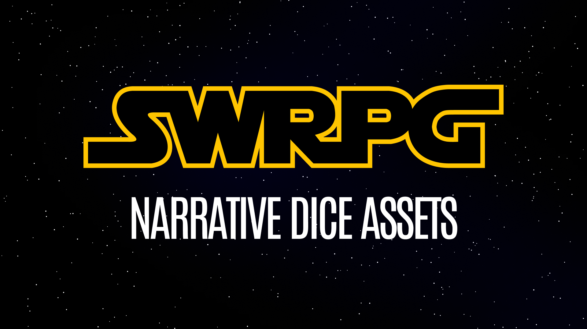
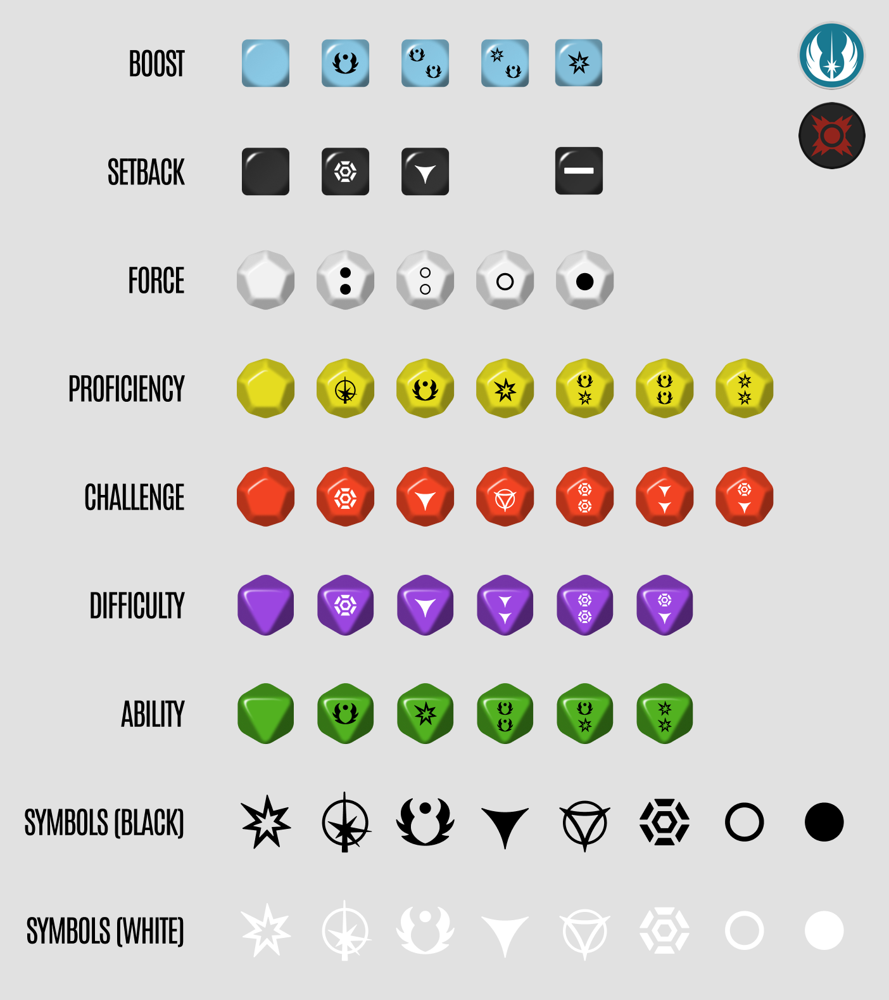
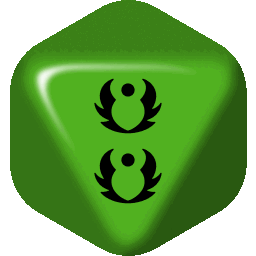
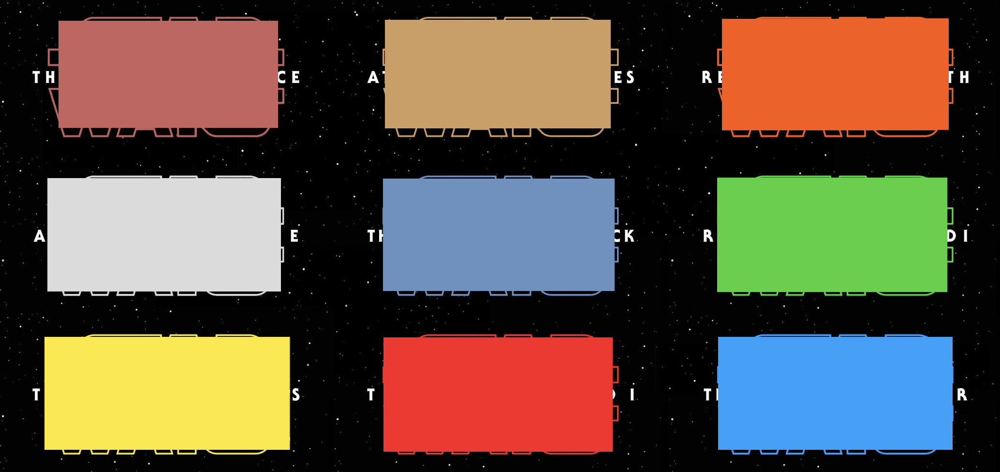
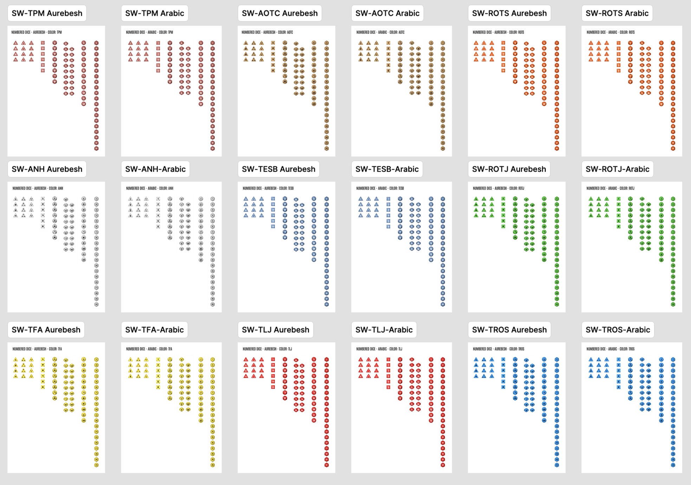
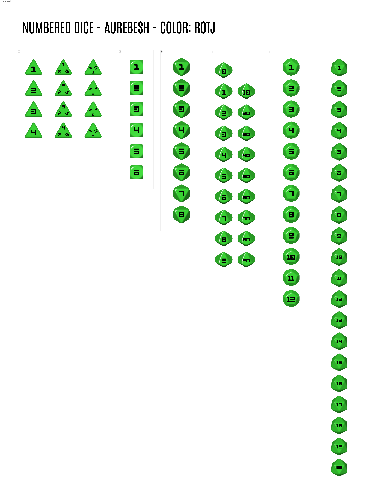
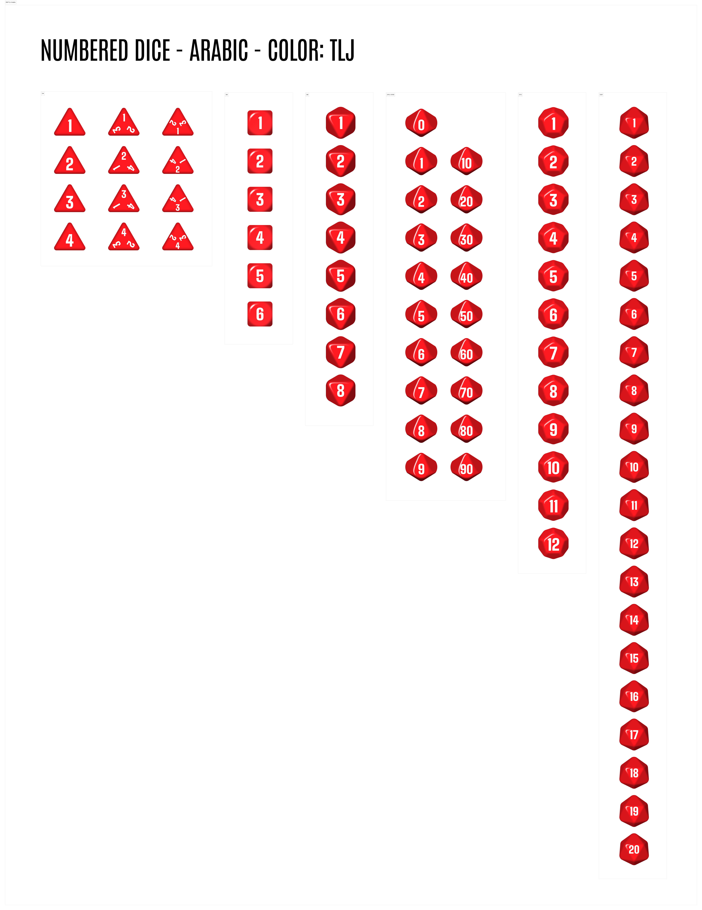

# SWRPG Online Art Assets



This repository contains a collection of SVG and other art assets for use in Star Wars Roleplaying Game (SWRPG) online tools and applications.

## Features

### Narrative Dice



### Animated GIF files

Useful for simulating rolling the dice



### Numeric dice with every color from the movie logos





### Numeric Dice come in Arabic or Aurabesh Numerals




## Installation

```bash
npm install @swrpg-online/art
```

## Usage

### React Components (Recommended)

```tsx
import { ProficiencyDice } from '@swrpg-online/art/dice/narrative/D12-Proficiency-Success.svg';

function DiceComponent() {
  return (
    <div>
      <ProficiencyDice className="w-12 h-12" />
    </div>
  );
}
```

To make this work, add the following to your `vite.config.ts`:

```typescript
import { defineConfig } from 'vite';
import svgr from 'vite-plugin-svgr';

export default defineConfig({
  plugins: [svgr()],
});
```

### Angular Components

```typescript
import { Component } from '@angular/core';
import { DomSanitizer } from '@angular/platform-browser';
import type { SafeUrl } from '@angular/platform-browser';

@Component({
  selector: 'app-dice',
  template: `
    
  `
})
export class DiceComponent {
  proficiencyDice: SafeUrl;

  constructor(private sanitizer: DomSanitizer) {
    // Import the SVG content directly
    const svgContent = require('@swrpg-online/art/dice/narrative/D12-Proficiency-Success.svg');
    this.proficiencyDice = this.sanitizer.bypassSecurityTrustUrl(svgContent);
  }
}
```

To make this work, add the following to your `angular.json`:

```json
{
  "projects": {
    "your-project": {
      "architect": {
        "build": {
          "options": {
            "assets": [
              {
                "glob": "**/*",
                "input": "node_modules/@swrpg-online/art/dice",
                "output": "/assets/dice"
              }
            ]
          }
        }
      }
    }
  }
}
```

### TypeScript Support

The package includes framework-agnostic TypeScript support:

```typescript
// React usage
import type { SVGProps } from 'react';
import { ProficiencyDice } from '@swrpg-online/art/dice/narrative/D12-Proficiency-Success.svg';
const Dice: React.FC<SVGProps<SVGSVGElement>> = ProficiencyDice;

// Angular usage
import type { SafeUrl } from '@angular/platform-browser';
const svgContent: string = require('@swrpg-online/art/dice/narrative/D12-Proficiency-Success.svg');
const safeUrl: SafeUrl = sanitizer.bypassSecurityTrustUrl(svgContent);
```

## Directory Structure

- `dice/` - Contains dice-related SVG and PNG assets
  - `narrative/` - Narrative dice SVGs (Proficiency, Challenge, etc.)
  - `numeric/` - Numeric dice SVGs (Aurebesh and Arabic styles)
    - `aotc/` - Attack of the Clones style
    - `anh/` - A New Hope style

## Licensing

These art assets are available under a dual-license model:

1. **Open Source License (CC BY-NC-SA 4.0)**
   - Free for use in open source projects
   - Requires attribution
   - Non-commercial use only
   - Share-alike (derivatives must use the same license)
   - See the [LICENSE](LICENSE) file for full details

2. **Commercial License**
   - Available for commercial use
   - Requires a separate license agreement
   - Contact information available in [CONTACT.md](CONTACT.md)

I'm open to other licensing models, feel free to open an issue to discuss. The goal is to recoup design costs while still providing to the open source and swrpg communities.

## Usage Guidelines

### For Open Source Projects

1. You must provide attribution to the original creator
2. You must include a link to this repository
3. You must indicate any modifications made to the assets
4. Your project must be open source and use the same CC BY-NC-SA 4.0 license for derivative works

### For Commercial Projects

1. Contact the creator through the information provided in [CONTACT.md](CONTACT.md)
2. Discuss your specific use case and requirements
3. Obtain a commercial license before using the assets

## Contributing

While this is primarily an asset repository, suggestions and improvements are welcome. Please open an issue to discuss any proposed changes.

## Support

For questions about licensing or usage, please refer to the [CONTACT.md](CONTACT.md) file.

## Shoutout

[Lauren Herda for designing beautiful dice with us!](https://www.herda.me/)
